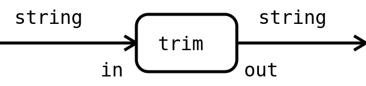

# Boxes vs. Lego


---
## Boxes are awesome


Note:
- They have a simple interface
- They hide details
- They can be used anywhere
- They can be put into other boxes

---
## Functions are like boxes

```go
func TrimLeftFunc(s string, f func(rune) bool) string {
	i := indexFunc(s, f, false)
	if i == -1 {
		return ""
	}
	return s[i:]
}
```

- They have a simple interface |
- They hide details |
- They can be used anywhere |
- They can be called from other functions |

---
## Boxes are awful


Note:
- They aren't standardized
- Padding is need for nesting
- If you nest them deep enough it's hard to find something
- They can't be composed
- I have never seen a storage built out of boxes

---
## Functions are like boxes

```go
func TrimLeftFunc(s string, f func(rune) bool) string {
	i := indexFunc(s, f, false)
	if i == -1 {
		return ""
	}
	return s[i:]
}
```

- There are no standards |
- Glue code is needed for combining them |
- They can't be composed |
- I have seen too many programs built out of functions |

---
## Lego bricks are awesome


Note:
- They have a simple interface
- They have standardized sizes and forms
- They hide details
- They can be used almost anywhere
- They combine with other Lego bricks
- You have 2 distinct phases: build and play

---
## Graphical representation



- The interface is simple |
- It has got a standardized form |
- The implementation is hidden |
- It can be used almost anywhere |

---
## They combine to flows


The combined ops look like a single op

---
## Code for operation

```go
type StringFilter func(out func(string)) (in func(string))
```

- The interface is simple |
- It has got a standardized form |
- The implementation is hidden |
- It can be used almost anywhere |

+++
## Code for operation

```go
type StringFilter func(out func(string)) (in func(string))

func TrimLeft(out func(string)) (in func(string)) {
	in = func(s string) {
		t := strings.TrimLeft(s, " \t\r\n")
		out(t)
	}
	return
}
```

Note:
- The implementation is quite simple.
- There is a little overhead but not much.

---
## Code for flow


```go
func Trim(out func(string)) (in func(string)) {
	trIn := TrimRight(out)
	in = TrimLeft(trIn)
	return
}
```

Note:
- This code doesn't contain any logic
- It is just assemling ops
- You won't find it at worktime

---?code=cmd/trim/main.go
@[9-16](TrimLeft is as before)
@[18-28](TrimRight can panic)
@[30-35](Trim just plugs them together)
@[37-43](main builds and runs the flow two times)

+++
## Stacktrace

```
Trim: `abc`
panic: show us the stack trace

goroutine 1 [running]:
main.TrimRight.func1(0x4baede, 0x2)
		.../cmd/trim/main.go:23 +0xf9
main.TrimLeft.func1(0x4baedd, 0x3)
		.../cmd/trim/main.go:13 +0x70
main.main()
		.../cmd/trim/main.go:40 +0x6e
exit status 2
```

---
## 'Filters' are very versatile

```go
func LogString(out func(string)) (in func(string)) {
	in = func(s string) {
		log.Println(s)
		out(s)
	}
	return
}

func Trim(out func(string)) (in func(string)) {
	trIn := TrimRight(out)
	lIn := LogString(trIn)
	in = TrimLeft(lIn)
	return
}
```
... you can always squeeze them between two ops with the right data type

---
## Error handling

```go
type ErrorFilter func(out func(string),
					  err func(error)) (in func(string))

func ReadFile(out func(string),
			  err func(error)) (in func(string)) {
	in = func(s string) {
		if content, e := ioutil.ReadFile(s); e != nil {
			err(e)
			return
		}
		out(string(content))
	}
	return
}
```
... without `if err != nil { ...` on **all** levels

---
## Generic Operations

```go
func ReadFile(out func(interface{}), err func(error),
			  getName(interface{})string,
			  setContent(interface{}, []byte)interface{},
			 ) (in func(interface{})) {
	in = func(d interface{}) {
		if b, e := ioutil.ReadFile(getName(d)); e != nil {
			err(e)
			return
		}
		out(setContent(d, b))
	}
	return
}
```
... are almost the same

---
## Generic flows with 'holes'

```go
type StringFilter func(out func(string)) (in func(string))

func Trim(out func(string),
		  f StringFilter) (in func(string)) {
	trIn := TrimRight(out)
	fIn := f(trIn)
	in = TrimLeft(fIn)
	return
}
```
Other forms are possible of course.

---
## Conclusion

- The software 'Lego bricks' are more versatile than real ones |
- They are useful at scale |
- The rest is left to your imagination |

---
## References:

- FlowDev project: [https://github.com/flowdev](https://github.com/flowdev)
- Slides online: [https://gitpitch.com/flowdev/present-go-boxes-lego](https://gitpitch.com/flowdev/present-go-boxes-lego)

## Attribution:

<div>Icons made by <a href="http://www.freepik.com" title="Freepik">Freepik</a> and <a href="https://www.flaticon.com/authors/coucou" title="Coucou">Coucou</a> from <a href="https://www.flaticon.com/" title="Flaticon">www.flaticon.com</a> is licensed by <a href="http://creativecommons.org/licenses/by/3.0/" title="Creative Commons BY 3.0" target="_blank">CC 3.0 BY</a></div>

<div>Photo made by <a href="https://www.flickr.com/people/skrewtape/" title="Screwtape">Screwtape</a> from <a href="https://www.flickr.com/photos/skrewtape/851672959" title="Flickr">www.flickr.com</a> is licensed by <a href="https://creativecommons.org/licenses/by-sa/2.0/" title="Creative Commons BY-SA 2.0" target="_blank">CC BY-SA 2.0</a></div>
